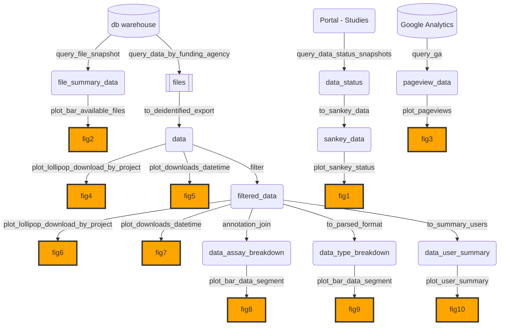

# usagereports

This contains scripts and an Rmarkdown template to generate data usage reports for a funder.
**No real data** lives here. 
To propose a new plot figure, you *should* add a corresponding function to create example data so it's clear what the data looks like.

The collection of functions in `R` are:
- `query_*` : Query and compile data from data warehouse, portal assets, Google Analytics, etc.
- `to_*` : Take data output from `query_*` and massage to the structure needed for specific plots or other forms. 
- `plot_*` : Generate plots that go into the report.
- `simd_*` : Simulate example data for the corresponding plots.

## Diagram

Overall, the functions can be put together in the manner represented below to generate the desired figures.
Figures are approximately numbered by the order in which they appear in the "suggested" report format.
However, the package should make it easy to just use for 1-2 figures or mix and match for another report format.

**Please contribute back if you have additional or alternative figures that would be useful!**

## Installation

This relies on two non-CRAN packages that should be installed via `devtools`:

- `devtools::install_github("Sage-Bionetworks/synapseusagereports")`
- `devtools::install_github("davidsjoberg/ggsankey")`
