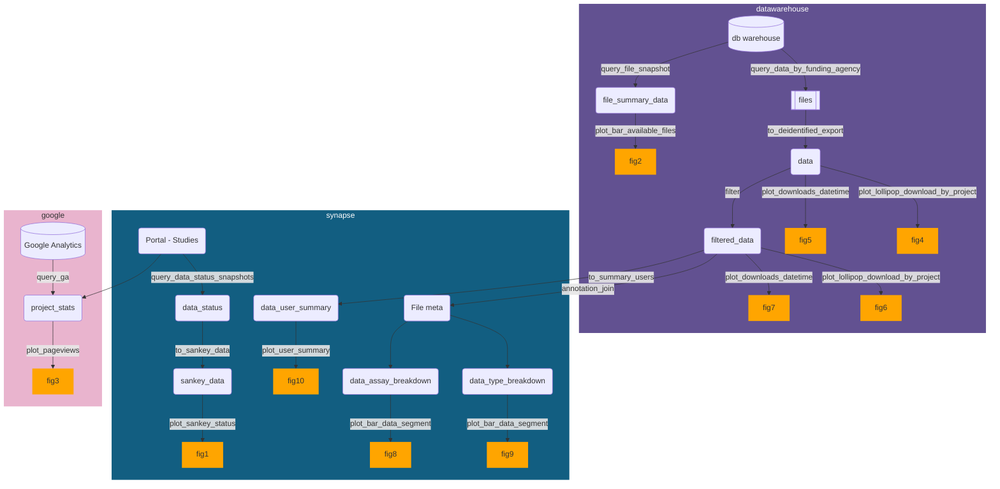

# usagereports

This contains scripts and an Rmarkdown template to generate data usage reports for a funder.
**No real data** lives here. 
To propose a new plot figure, you *should* add a corresponding function to create example data so it's clear what the data looks like.

The collection of functions in `R` are:
- `query_*` : Query and compile data from data warehouse, portal assets, Google Analytics, etc.
- `to_*` : Take data output from `query_*` and massage to the structure needed for specific plots or other forms. 
- `plot_*` : Generate plots that go into the report.
- `simd_*` : Simulate example data for the corresponding plots.

## Workflow

Overall, the functions can be put together in the manner represented below to generate the desired figures.
Figures are approximately numbered by the order in which they appear in the "suggested" report format.
However, the package should make it easy to just use for 1-2 figures or mix and match for another report format.

**Please contribute back if you have additional or alternative figures that would be useful!**

### Templates

Helper templates are provided for the data prep:
- For legacy datawarehouse data (purple workflow domain): `rmarkdown::draft(file = "Data-prep-DW-YYYY-MM", template = "prepare-data-legacy", package = "usagereports")`
- (Comming soon) For Synapse and Google Analytics data (teal and pink workflow domains): `rmarkdown::draft(file = "Data-prep-Syn-GA-YYYY-MM", template = "prepare-data-synapse-ga", package = "usagereports")`

Once data prep is done, the report template can be used:
- (Comming soon) `rmarkdown::draft(file = "Funder-Report-Issue-x", template = "report", package = "usagereports")`

## Installation

### OS dependencies installation

SQL db or client:
- deb: `libmysqlclient-dev` (Debian, Ubuntu, etc)
- brew: `mysql` (OSX)

This needs `libsodium` for encrypting/de-encrypting some data.
- deb: `libsodium-dev` (Debian, Ubuntu, etc)
- brew: `libsodium-dev` (OSX)

### R dev package dependencies

This relies on two non-CRAN packages that can be installed via `devtools`:

- `devtools::install_github("Sage-Bionetworks/synapseusagereports")`
- `devtools::install_github("davidsjoberg/ggsankey")`

Then: 
`devtools::install_github("nf-osi/usagereports")`

(Or for contributors) Clone this repo and install locally with:
`devtools::install()`

