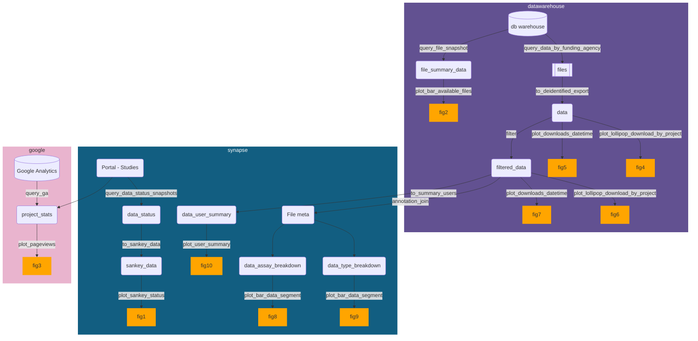

# usagereports

This contains query scripts and an Rmarkdown template to generate data usage reports for a funder.
**No real data** lives here. 
To propose a new figure, it is *recommended* that you add a corresponding function to create example data to help users see what data is expected/what shape they need to get their data into.

The collection of functions in `R` are prefixed with their intent:
- `query_*` : Query and compile data from data warehouse, portal assets, Google Analytics, etc.
- `to_*` : Take data output from `query_*` and massage to the structure needed for specific plots or other forms. 
- `plot_*` : Generate plots that go into the report.
- `simd_*` : Simulate example data for the corresponding plots.

There are several ways in which you can view and engage with this package:

1. For heavily guided usage and workflow to put together a full biannual or annual PDF report deliverable for a sponsor funder. 
See the supporting flowchart and templates below; figures are approximately numbered by the order in which they appear in the "suggested" report format.

2. For *a la carte* generation of just 1-2 figures that you like, e.g to include independently in some slides instead of an entire report. 

3. As a good starting place and conceptual catalog of interesting metrics/data products, even if you don't ultimately use any of the queries/plotting utils here. 
Consider contributing if you come up with something that others might also find useful.

4. As a playground and learning resource for R analytics and Snowflake.

## Development notes

This package is still in development; a version 1.0 is aimed for some time in 2024. Changes to be expected:

- Legacy warehouse functions and templates are deprecated and will be removed in the version 1.0 release.
- Workflow reconfiguration and new utils that will use Snowflake as the new data warehouse source.
- Google Analytics and Synapse data prep templates will be split into separate templates for better modularity/understanding.

### Templates

#### Data prep templates

**Data warehouse (purple domain)**
- Snowflake template is WIP.
- If you still need to use legacy data warehouse, *install package at v0.0.9600* and set up with: `rmarkdown::draft(file = "Data-prep-DW-YYYY-MM", template = "prepare-data-legacy", package = "usagereports")`

**Synapse (teal domain) and Google Analytics (pink domain)**
- Set up with `rmarkdown::draft(file = "Data-prep-Syn-GA-YYYY-MM", template = "prepare-data-synapse-ga", package = "usagereports")`

#### Reporting template

Once data prep is done, the report template can be used. Note that not all reporting features may apply or are covered for other DCCs, so treat this as a starting point for customization:
- (Coming soon) `rmarkdown::draft(file = "Funder-Report-Issue-x", template = "report", package = "usagereports")`

## Installation

### OS dependencies installation

This needs `libsodium` for encrypting/de-encrypting some data.
- deb: `libsodium-dev` (Debian, Ubuntu, etc)
- brew: `libsodium-dev` (OSX)

(Only for legacy warehouse)
SQL db or client:
- deb: `libmysqlclient-dev` (Debian, Ubuntu, etc)
- brew: `mysql` (OSX)

### R dev package dependencies

This relies on a non-CRAN packages that can be installed via `devtools`:
- `devtools::install_github("davidsjoberg/ggsankey")`

(Only for legacy warehouse)

Then: 
- `devtools::install_github("nf-osi/usagereports")`
- (Or for potential contributors) Clone this repo and install locally with: `devtools::install()`

### Snowflake connection deps

For using reporting utils with Snowflake infra, you'll need to install drivers and follow docs here:
https://developers.snowflake.com/odbc/

