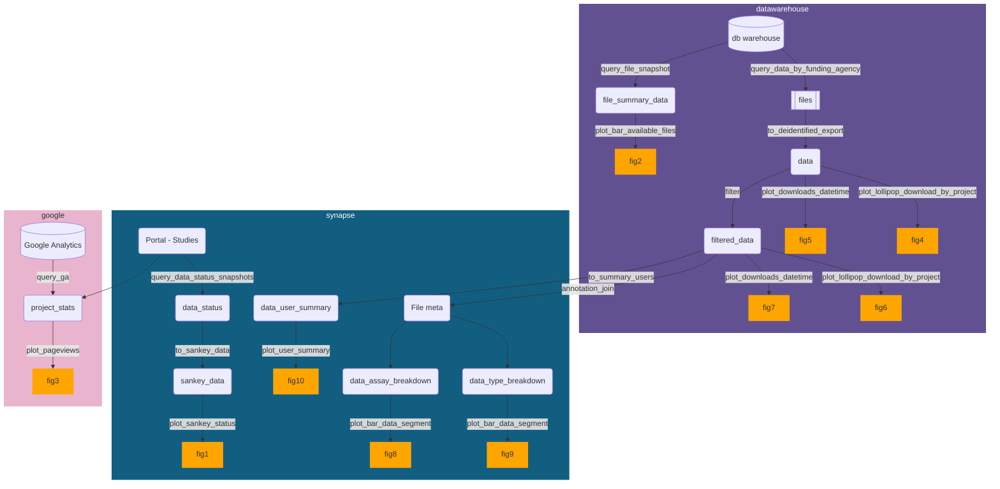

# usagereports

## Intro

This is an R package with functions and templates to generate figures for data usage PDF reports or presentations.
**No real data** lives here. 

The collection of functions in `R` are prefixed with their intent:
- `query_*` : Query and compile data from data warehouse, portal assets, Google Analytics, etc.
- `to_*` : Take data output from `query_*` and massage to the structure needed for specific plots or other forms. 
- `plot_*` : Generate plots that go into the report.
- `simd_*` : Simulate example data for the corresponding plots.

## Why have a reporting package?

1. Sometimes funders or regulatory agencies just prefer/require reports in a PDF or presentation, in a certain format and with plenty of narration and references.
Also, a dashboard is great for presenting less complicated weekly and monthly metrics, while this is a product meant for annual reports.  
2. Puts together some good ideas for *which* metrics and *how* to get and present them.
This is also **a conceptual catalog of figures and an inspirational starting place for interesting metrics/analyses**. 
See the [ideas doc](https://github.com/nf-osi/usagereports/blob/main/notes.md). 
**Consider contributing if you come up with something that others might also find useful.**
3. More than just individual figures, provide useful [templates](#Templates) and transformations for overall integration (see below).
Figures are approximately numbered by the order in which they appear in the "suggested" report format.

```mermaid

flowchart TD
    
    classDef fig fill:orange,stroke:#333,stroke-width:0px;
    class fig1,fig2,fig3,fig4,fig5,fig6,fig7,fig8,fig9,fig10 fig;
    style datawarehouse fill:#625191,stroke-width:0px
    style synapse fill:#125e81,stroke-width:0px
    style google fill:#e9b4ce,stroke-width:0px
    style datawarehouse color:white
    style synapse color:white


    subgraph datawarehouse
        dw[(db warehouse)] -- query_data_by_funding_agency --> files[[files]] 
        dw -- query_file_snapshot --> file_summary_data(file_summary_data)
        file_summary_data -- plot_bar_available_files --> fig2:::fig
        files -- to_deidentified_export --> data(data) 
        data -- plot_lollipop_download_by_project --> fig4:::fig
        data -- plot_downloads_datetime --> fig5:::fig
        data -- filter --> filtered_data(filtered_data)
        filtered_data -- plot_lollipop_download_by_project --> fig6:::fig
        filtered_data -- plot_downloads_datetime --> fig7:::fig
    end
    
    subgraph synapse
        studies(Portal - Studies) -- query_data_status_snapshots --> data_status(data_status)
        data_status -- to_sankey_data --> sankey_data(sankey_data)
        sankey_data(sankey_data) -- plot_sankey_status --> fig1:::fig

        filemeta(File meta) --> data_type_breakdown(data_type_breakdown)
        filemeta(File meta) --> data_assay_breakdown(data_assay_breakdown)
        filtered_data -- annotation_join --> filemeta
        data_assay_breakdown -- plot_bar_data_segment --> fig8:::fig
        data_type_breakdown -- plot_bar_data_segment --> fig9:::fig
        filtered_data -- to_summary_users --> data_user_summary(data_user_summary)
        data_user_summary -- plot_user_summary --> fig10:::fig
    end

    subgraph google
        studies --> project_stats
        GA[(Google Analytics)] -- query_ga --> project_stats(project_stats)
        project_stats -- plot_pageviews --> fig3:::fig
    end
    
```

4. Build in Synapse-default themes and color palettes.

5. A playground and learning resource for R, complementary to the Snowflake resource https://github.com/Sage-Bionetworks/snowflake. 

### Templates

#### Data prep and exploration

**Data warehouse (purple domain)**
- Snowflake starter template: `rmarkdown::draft(file = "Data-prep-Snowflake-YYYY-MM", template = "prepare-data-snowflake", package = "usagereports")`

**Synapse (teal domain) and Google Analytics (pink domain)**
- Set up with `rmarkdown::draft(file = "Data-prep-Syn-GA-YYYY-MM", template = "prepare-data-synapse-ga", package = "usagereports")`
- Note: these will be split up into their own templates in future releases.

#### Reporting template

Once data prep is done, the report template can be used. 
Not all reporting features may apply or are covered for other DCCs, so treat this as a starting point for customization:
- (Coming soon) `rmarkdown::draft(file = "Funder-Report-Issue-x", template = "report", package = "usagereports")`

## Installation

### OS dependencies

This needs `libsodium` for encrypting/de-encrypting coded data.
- deb: `libsodium-dev` (Debian, Ubuntu, etc)
- brew: `libsodium` (OSX)

### R dev package dependencies

This relies on a non-CRAN packages that can be installed via `devtools`:
- `devtools::install_github("davidsjoberg/ggsankey")`

Then: 
- `devtools::install_github("nf-osi/usagereports")`
- (Or for potential contributors) Clone this repo and install locally with: `devtools::install()`

### Snowflake connection dependencies (optional)

If you'd like to interact with Snowflake without leaving RStudio (which *does* allow a more seamless workflow for updating figures), see [here](https://solutions.posit.co/connections/db/databases/snowflake/).

However, this package is also pretty agnostic about which interface is used, so OK to just plug in data exported from the Worksheets UI, SnowSQL (CLI), or VSCode extension.

## Development notes

This package is in development and will depend on a new backend (itself also in development) being stabilized. 
Version 1.0 is possible some time in 2024, and current developments are focused on:

- Deprecation of legacy warehouse functions and templates and replacing everything as applicable with new backend.
- Split Google Analytics and Synapse data prep, aiming for greater modularity and greater generalization.
- Setting up more overall package checks and tests.

### Contributing guide

- Create a branch for changes and make a pull request against `main`.
- To propose a new figure, it is *recommended* that you add a corresponding function to create example data to help users see what data is expected/what shape they need to get their data into.
